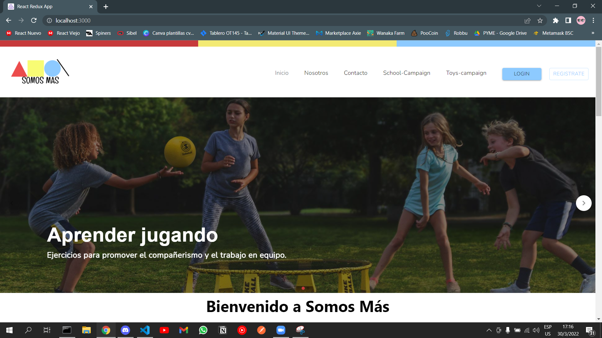
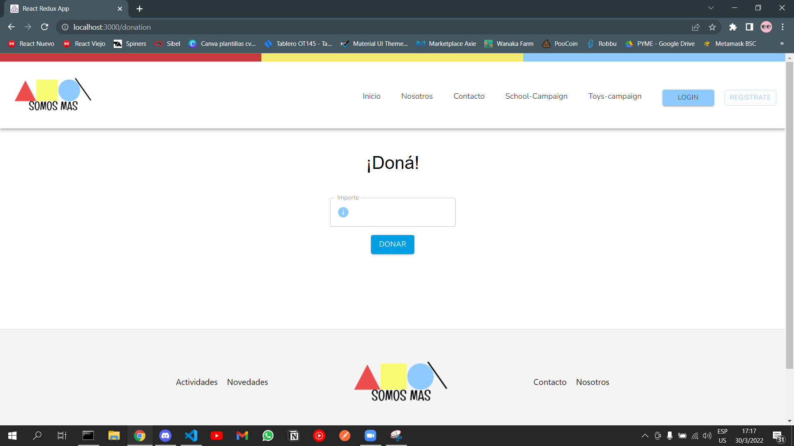
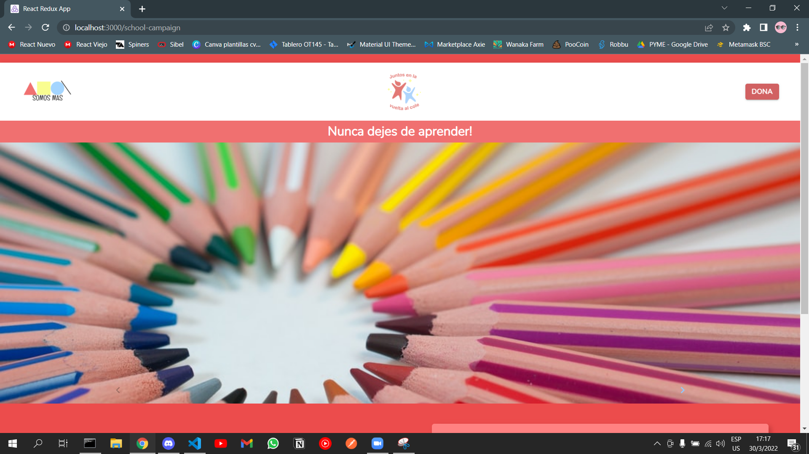
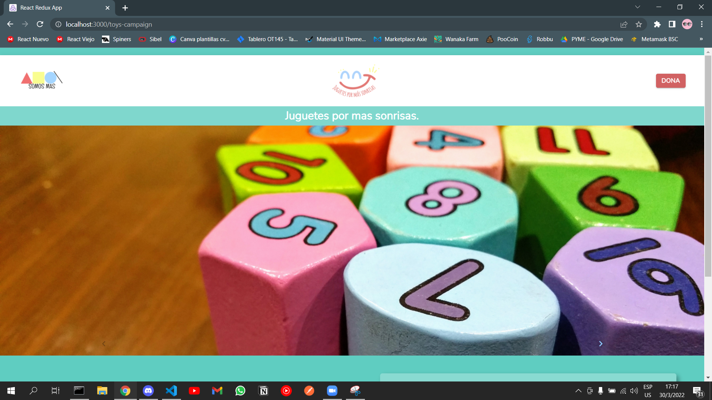

# ONG SOMOS MAS
Este proyecto consta con campañas bien marcadas como eran la campaña escuela y la campaña juguetes. Donde en toda la aplicación se trata de mostrar en las diferentes secciones los diferentes trabajos que se realizan en dichas campañas.
Por otro lado la aplicación tiene dos partes: La primera es para los usuario finales y la segunda parte son para los usuario administradores. Para poder manejar esto, la aplicación cuenta con un login, que al iniciar sesión dependiendo la persona podrías ser **Admin** o **Standard**. Desde el usuario Admin podías manejar todo el backoffice, en otras palabras conseguirías cambiar ciertas publicaciones como por ejemplo: Cambiar una imagen, cambiar un texto etc.
Desde el usuario standard podrás donar a través de mercado pago un beneficio que solo tienen estos usuarios a comparación de un usuario normal.

